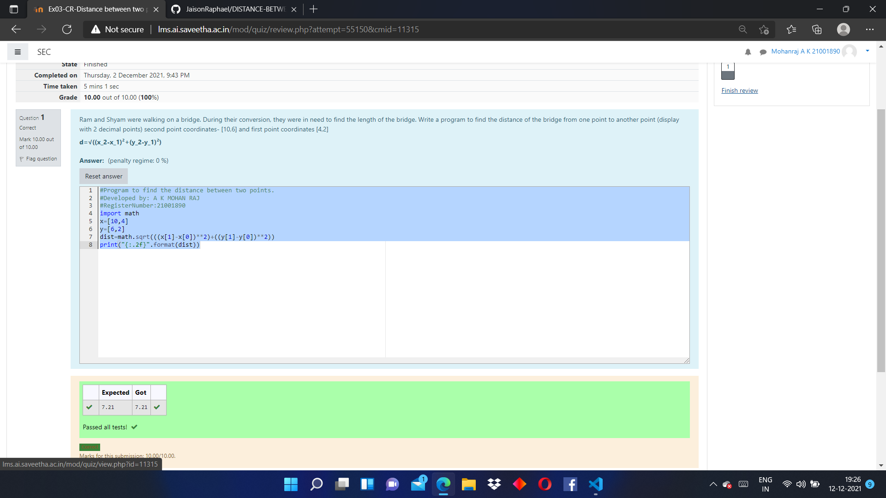

# DISTANCE-BETWEEN-TWO-POINTS

## AIM:
To write a python program to find the distance two 2 points
## ALGORITHM:
### Step 1:
Start the program 
### Step 2: 
Import math
### Step 3: 
Substitute the values in the distance formula 
### Step 4:
Print the program 
### Step 5: 
End the program
### PROGRAM:
```
#Program to find the distance between two points.
#Developed by: A K MOHAN RAJ
#RegisterNumber:21001890
import math
x=[10,4]
y=[6,2]
dist=math.sqrt(((x[1]-x[0])**2)+((y[1]-y[0])**2))
print("{:.2f}".format(dist))
```


### OUTPUT:



### RESULT:
Thus the distance betweem two points are found using python program